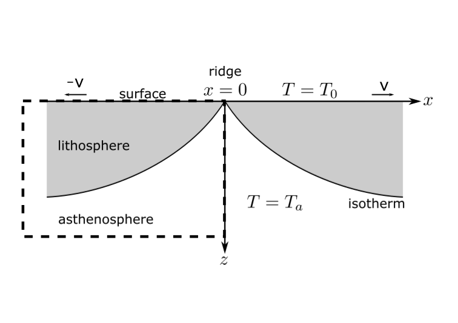

<h1 style="color:blue">Geol20002 - Week 11 Prac. (Geodynamics)</h1> 

## Thermal Boundary Layers and the oceanic lithosphere

* **This practical is not assessed !!**
* **See the PDF version for proper equation formatting**
* **We'll be working through this together**
* **Please feel free to self organise into small groups**
* 👉This Document also available here [GEOL20002 Practical Repository](https://github.com/earthquake-research-group/geol20002Practical)

### **🌍**  **Key Background Concept**s

In the lecture we explore some major insights from the **plate tectonics revolution of the 1960s**:

- The **oceanic lithosphere** represents the **cooling thermal boundary layer** of a convecting mantle system.
- **Mid-ocean ridges** are *passive* features
- Mantle rock upwells,  moves away from the ridge in a rigid manner, and its thermal evolution can be captured by the physics of conductive heat transfer. 
- The evolution of the temperature field can be described by a partial differential equation (PDE). Sometimes these can be solved with pen-and-paper (analysis, or analytic solution); or we can use numerical methods (i.e. computers) to arrive at solutions. 

##  What are we aiming to do here?

**This!** 👉


We're going to use a web-based tool called **VisualPDE** to solve the advection-diffusion equation (also called convection-diffusion), and apply this to the cooling of a thermal boundary layer. 

In this case we will be exploring a solution in 2D. 

To refresh your memory from the lecture, here is a diagram of the model setup. Note that **VisualPDE** refers to the vertical dimension as $y$ (not $z$)



**Figure**: Model setup for halfspace cooling. This shows the lithosphere cooling as it moves away from the ridge at \( x = 0 \), with surface velocity \( v \), surface temperature \( $T = T_0$ \) and basal temperature \( $T = T_a$). The velocity field is horizontal and uniform, representing idealised rigid plate motion. The curved isotherms reflect conductive cooling into the lithosphere over time. 

The dashed square box in the above figure represents (schematically) the domain we'll be working with.  Using **VisualPDE**  we'll need to figure out how to set **boundary conditions** & **initial conditions**, and set the velocity field $v$.

## Step 1: 🌐 Access VisualPDE

You can launch the pre-set simulation directly here:

👉 [**Interactive Simulation with Unidirectional Advection**](https://visualpde.com/sim/?preset=AdvectionEquationDirected)

Alternatively, go to:

🔗 https://visualpde.com/basic-pdes/advection-equation

And then click ➡️  `interactive simulation with unidirectional advection`

----

Once you access the simulator, **try clicking anywhere** on your screen...

What happened?

* You're creating a perturbation (a localised source) of a quantity called $u$

 **try clicking and holding anywhere** on your screen..

* so what is $u$?

## Step 2: Get our bearings!

In this example **VisualPDE** simulator solves a generic advection-diffusion  equation:

```math
\frac{\partial u}{\partial t} + \mathbf{v} \cdot \nabla u = D \nabla^2 u
```


How to interpret these terms:


```math
\underbrace{\frac{\partial u}{\partial t}}_{\text{Rate of change of u }}\;+\;\underbrace{\mathbf{v} \cdot \nabla u}_{\text{Advection (transport by flow)}}\;=\;\underbrace{D \nabla^2 u}_{\text{Diffusion (spreading out)}}
```


This is the 2D version of the (1D) equation we derived in the lecture, with an extra term that accounts for advection. **Advection** simply means that the heat is being carried by the flow, while **diffusion** causes it to spread out from the source. The rate of temperature change at any point is determined by the **local balance between advection and diffusion**.

- $u(x,y)$: a generic scalar quantity  - think of this as our **temperature** field $T(x,y$)
- $\mathbf{v}(x,y)$: the velocity vector
- $D$: a generic diffusivity (this is how we change our **thermal diffusivity** $\kappa$)

In general, the solution of a  PDE depends on:

* material parameters (e.g., $D$)
* the **initial conditions** at the start of the simultion, and the **boundary conditions**

To set these options in **VisualPDE**

​	➡️ click on the $f(x)$ button in the top left corner

**summary**

With this basic introduction, you’ll hopefully now have a basic sense of what’s happening when you click on the screen. You’re creating a source of temperature — effectively adding heat at a specific location. That heat, represented by the field $u$, is then both **diffusing** and **advecting**.

## Step 3: Set the velocity field

In this particular example, the **velocity field** of the flow is **constant**. That means the **velocity vector** is the same at every point in space — it has:

- the **same direction** everywhere, and
- the **same magnitude** everywhere.

We can control the velocity field in two ways:

1. **Magnitude** (or speed): controlled by the scalar $V$ 
2. **Orientation** (or direction): controlled by the angle $\theta$

```math
v_x = V \cos(\theta)\\
v_y = V \sin(\theta)
```

We want to **simulate the cooling of a rigid oceanic plate** as it moves away from the **mid-ocean ridge**.

To do this, we follow the physical model first introduced by **Turcotte and Oxburgh (1967)**, which treats the plate as:

- **Perfectly rigid** (no internal deformation), moving with a **constant horizontal velocity** away from the ridge.

This simplification allows us to focus on how **heat is conducted and advected** through the lithosphere as it moves away from the ridge. 

**In VisualPDE:**

➡️ click on the $f(x)$ button, then ➡️  `parameters` to set $\theta$

* we want to set a uniform horizontal velocity field: $v_x = V,  v_y = 0$, what is $\theta$ ?
* start with the magnitude $V =1$

## Step 4: Set the initial condition 

Even though **mantle temperatures** are typically measured in **Kelvin**, and involve changes of more than thousand Kelvin, our focus here is on understanding the **scaling behavior** of the system — not the absolute temperatures in any particular scale.

In **fluid dynamics**, it’s common practice to **nondimensionalize** variables so that they vary between values close to 0 and 1. This simplifies analysis and highlights the **underlying physics**.

So, in our case:

- We define a **dimensionless temperature field**, $u$
- Where $u$ = 1 represents the **hot** temperature (e.g., at the base of the plate),
- And $u$ = 0 represents the **cold** temperature (e.g., at the ocean floor).

**In VisualPDE:**

➡️ click on the $f(x)$ button, then ➡️ `Initial conditions` 

* set $u = 1$, easy! 

## Step 5: Set the boundary conditions

When solving partial differential equations like the advection-diffusion equation, we need to specify what happens **at the edges** of our simulation domain. These are called the **boundary conditions**. They control how the system behaves at the edges — and are crucial for getting physically meaningful solutions.

**In VisualPDE:**

➡️ click on the $f(x)$ button, then ➡️ `Boundary Conditions` ➡️ `Mixed Boundary Conditions`,

This lets you choose custom boundary conditions for each of the 4 boundaries

- A **Dirichlet** boundary is where we fix the value of our variable (here $u$, being temperature), so it always has this value. Choose  ➡️ `Dirichlet`, and set the **value of** $u$ for
  - the **top** (cool surface, $u$ = 0)
  - the **bottom** (hot mantle, $u$ = 1)
  - One **side wall** (e.g. the ridge axis, $u$ = 1)
- For the other sidewall choose  ➡️ `Neumann`**,  and set the gradient to zero** 
  -  Think of a **Neumann** boundary it as a **“natural exit”** — material flows out, and the simulation doesn’t interfere.


## Step 6: Configure some visualisation 

**In VisualPDE:**

➡️ Click on the Layers icon ➡️ click `u` ➡️ `Edit view`

* find a colormap that you like...

* set some contours for the temperature field $u$

* Clicking on **“Vector Field”** in the VisualPDE interface lets you **visualize the gradient of the temperature field**, which is mathematically represented as:

  ```math
  \nabla u = \left( \frac{\partial u}{\partial x}, \frac{\partial u}{\partial y} \right)
  ```
  

To configure the **vector Field**, you'll need to set the 

* x_component: -u_x, 

* y_component: -u_y

What is this showing, and why the negative sign?


## Step 7: exploring the diffusive scaling relationship 

As discussed in the lecture, the **thickness of the thermal boundary layer** evolves as:

```math
\delta \sim \sqrt{\kappa t} \quad \text{and since} \quad t = \frac{x}{V}, \quad \Rightarrow \quad \delta \sim \sqrt{\frac{\kappa x}{V}}
```

* remember that in the **VisualPDE**, $D \equiv \kappa$, and $V$ is the velocity magnitude

So the **contour depth** at any horizontal distance $x$ should scale like:

```math
\delta(x) \propto \sqrt{\frac{D}{V}}
```


* Visually, make a note of the depth of a particular isotherm as indicated by the contour lines you sent up. 

* What happens if you multiply $V$ and $D$ by the same amount?

* What happens if you increase $D$ (leaving V fixed) by increments of $\times$2?  What might be happening here? Think about what the physics is trying to do, in relation to the boundary condition you set. 

## Step 7:

Go back to the **main visual PVE homepage** and choose a different **partial differential equation (PDE)** to explore. Read through the **background information** provided for that PDE to understand the physics behind it, and try to **play around with the simulation tools**.

Here are a couple of suggestions:

- The **Wave Equation** is a natural choice for geophysics. It describes how seismic waves propagate through the Earth, making it central to seismology and exploration geophysics.
- The **Navier–Stokes Equations** are fundamental to **geophysical fluid dynamics**. They govern the motion of fluids when **inertia matters** — meaning the effects of momentum are significant. These equations apply to:
  - The **atmosphere**
  - The **oceans**
  - **Magmas**
  - **Atmospheres of other planets**

This equation set is particularly rich and challenging to solve, but also incredibly powerful — used in climate models, weather forecasting, and simulations of planetary interiors and oceans.


<h1 style="color:blue">Further background/notes</h1> 


## PDEs - beyond 1D

The simulator is solving an advection-diffusion equation** for a scalar quantity $u$:

```math
\frac{\partial u}{\partial t} + \mathbf{v} \cdot \nabla u = D \nabla^2 u
``


This is equivalent to the **temperature advection-diffusion equation**:

```math
\frac{\partial T}{\partial t} + \mathbf{v} \cdot \nabla T = \kappa \nabla^2 T
```


In **one dimension**, you’ve seen the **second derivative** of temperature:

$\frac{d^2 T}{dx^2}$

But in **two dimensions**, temperature can vary in **both** the x-direction and the y-direction.

So we take the second derivative in **both directions**, and add them

```math
\nabla^2 T = \frac{\partial^2 T}{\partial x^2} + \frac{\partial^2 T}{\partial y^2}
```

This is called the **Laplacian** of T, or $\nabla^2 T$.

➡️  It’s like curvature, but in all directions at once.


## Limits of numerical methods

The default settings have the velocity $V = 1$ and the diffusivity $D = 0$. If you try **reducing** D (i.e. making the system more advection-dominated), you’ll eventually notice that the sources you add to the solution begin to produce **spurious oscillations**.

### **⚠️ Why Instabilities Occur at Low Diffusivity**

When $D \to 0$, the equation becomes **advection-dominated**. This poses a problem for many numerical methods, especially **explicit finite difference schemes**, because:

- Diffusion naturally smooths out noise and gradients.
- With very low diffusion, steep gradients can form (e.g., sharp fronts), and numerical schemes that aren’t designed for this tend to overshoot or produce oscillations.
- These errors can grow over time, leading to **instability**.

-----------------

**Walker, B. J., Townsend, A. K., Chudasama, A. K., & Krause, A. L.** (2023).  

*VisualPDE: rapid interactive simulations of partial differential equations*.  

**Bulletin of Mathematical Biology**, 85(11), 113. Springer.
